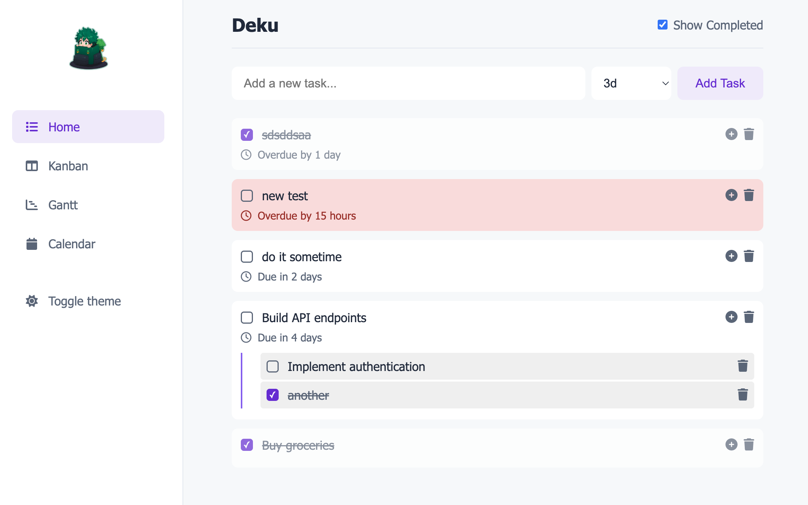
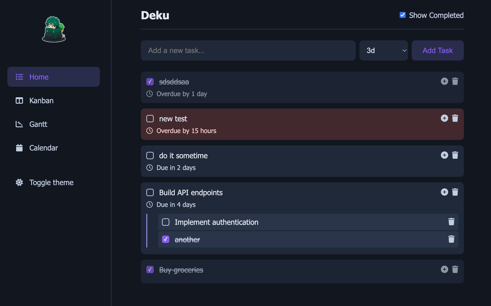
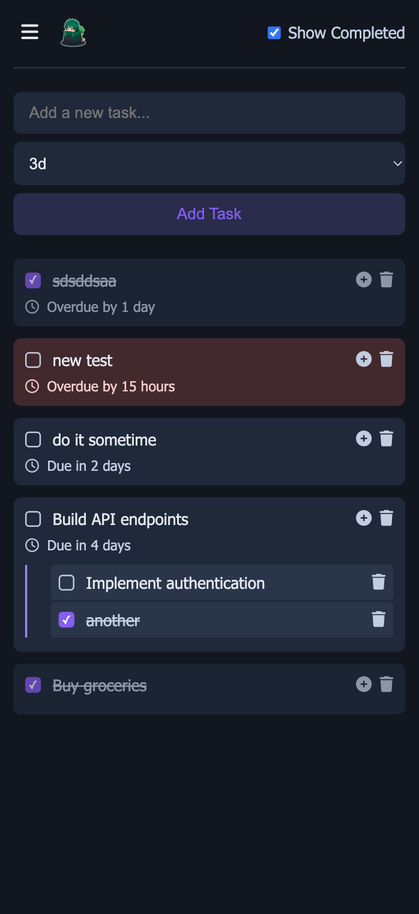

<div align="center">
<br><h1>Deku</h1>

<a href="https://github.com/tanq16/deku/actions/workflows/release.yaml"></a>&nbsp;<a href="https://github.com/Tanq16/deku/releases"></a>&nbsp;<a href="https://hub.docker.com/r/tanq16/deku"></a>
</div>

<p align="center">
<b>Deku</b> is a simple and minimal task tracker with support for various views and task management based on completion goals.
</p>

<p align="center">
<a href="#features">Features</a>&nbsp;&bull;&nbsp;<a href="#screenshots">Screenshots</a><br><a href="#installation">Installation</a>&nbsp;&bull;&nbsp;<a href="#usage">Usage</a>&nbsp;&bull;&nbsp;<a href="#technology-stack">Tech Stack</a>
</p>

## Features

### Core Functionality
- Simple task management with essential details (text, due dates, completion status)
- Parent-child relationship between tasks and subtasks
- Customizable task cycles (5m, 1h, 4h, 12h, 1d, 3d, 1w, 1m, 3m)
- JSON-based flat file storage system (`data/tasks.json`)
- REST API for task management
- Server-Sent Events (SSE) for real-time updates across all views
- Theme toggling with automatic dark/light mode preferences
- Self-contained binary and container image for easy deployment

### Multiple Views
1. **Home View**
   - Add, complete, and delete tasks and subtasks
   - Track task due times and overdue status
   - Toggle completed task visibility
2. **Kanban View**
   - Visual board with Upcoming, Today, Overdue, and Completed columns
   - Task cards showing due dates and completion status
3. **Gantt View**
   - Timeline visualization of task durations
   - Month-by-month navigation
   - Visual indicators for weekends and today's date
4. **Calendar View**
   - Daily, weekly, and monthly calendar layouts
   - Easy navigation between time periods
   - Clear visualization of scheduled tasks

### Progressive Web App (PWA)
- Install on desktop and mobile devices
- Offline capability
- Home screen icon for quick access

## Screenshots

| | Desktop View | Mobile View |
| --- | --- | --- |
| Light |  |  |
| Dark |  |  |

## Installation

### Docker Installation (Recommended)

```bash
docker run -d \
--name deku \
-p 8080:8080 \
-v deku_data:/app/data \
tanq16/deku:main
```

For Docker Compose or container management systems like Portainer/Dockge:

```yaml
version: "3.8"
services:
  deku:
    image: tanq16/deku:main
    restart: unless-stopped
    ports:
      - 8080:8080
    volumes:
      - /path/to/data:/app/data # Change as needed
```

### Binary Installation

Download the appropriate binary for your system from the [latest release](https://github.com/tanq16/deku/releases/latest).

Run the binary and the application will be available at `http://localhost:8080`.

### Building from Source

```bash
git clone https://github.com/tanq16/deku.git && \
cd deku && \
go build .
```

With Go 1.24+ installed, you can also use:

```bash
go install github.com/tanq16/deku@latest
```

## Usage

Access the web interface through your browser at `http://localhost:8080/`

Navigate between different views using the sidebar:
- Home (list view): `http://localhost:8080/`
- Kanban board: `http://localhost:8080/kanban`
- Gantt chart: `http://localhost:8080/gantt`
- Calendar: `http://localhost:8080/calendar`

> [!NOTE]
> This app has no authentication, so deploy carefully. It works well with a reverse proxy like Nginx Proxy Manager and is mainly intended for homelab use.

### REST API

Add Task:

```bash
curl -X POST http://localhost:8080/api/task/add \
-H "Content-Type: application/json" \
-d '{
    "text": "My new task",
    "cycle": "1d"
}'
```

Complete Task:

```bash
curl -X POST http://localhost:8080/api/task/complete \
-H "Content-Type: application/json" \
-d '{
    "id": "task-uuid"
}'
```

Delete Task:

```bash
curl -X POST http://localhost:8080/api/task/delete \
-H "Content-Type: application/json" \
-d '{
    "id": "task-uuid"
}'
```

List All Tasks:

```bash
curl http://localhost:8080/api/tasks
```

## Technology Stack

- Backend: Go
- Storage: JSON file system
- Frontend: Vanilla JavaScript, HTML, and CSS
- Real-time updates: Server-Sent Events (SSE)
